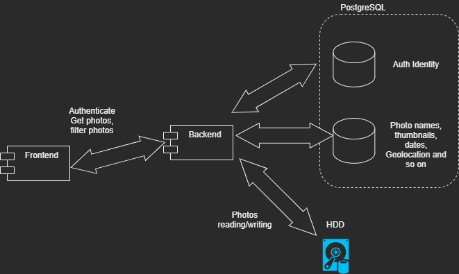

# PhotoLibrary

## 1. Introduction and Goals

This document describes the `PhotoLibrary` application. It used as home photo library observer. A family photos was collected during 15 years just as non-organized folder on a USB hard drive and takes up 200Gb. The purpose of the application is to organize photos, make them easy accessible from any device which connected to the local home network.

### 1.1 Requirements Overview

The following goals have been established for this system:
| | |
| --- | --- |
| 1. | Whole library should still be stored in USB hard drive |
| 2. | Library should be accessed from any device connected to the local home network |
| 3. | Photos can be filtered by date, location, some tags |
| 4. | Import mechanism. New photos can be added to the library from iPhones |
| 5. | UI should be adaptive to the desktop or mobile screen |
| 6. | App should be accessible only for logged-in users |

### 1.2. UI design

TODO: To be added

### 1.3. Use cases

Start screen looks like iPfone photo app. It shows last photos in library sorted by date from latest to early.

### 1.3.1. Home screen


1. Photos shown in the list ordered by date from latest photo.
2. Photos loading by chunks while user scrolls.
3. While scrolling the appropriate chip in the top becomes active.
4. By clicking the chip in the top, photos shows selected year - sorted from bottom tot top

TODO: To be added

## 2. Architecture Constraints

Application can not be accessible outside of the local home network

### 2.1. Making the thumbnails from videos

There is a way to make a thumbnail from video file using the `NReco.VideoConverter` nuget library. But `NReco.VideoConverter` is only for Windows. There is an alternative lib - `NReco.VideoConverter.LT`, but there is a license needed (75$).

But fortunately, the Raspberry PI OS contains the `ffmpeg` utility by default. And there is a way to make thumbnails using this command:

```bash
ffmpeg -i IMG_6976.MOV -ss 00:00:01.000 -vframes 1 _thumbnail_IMG_6976.jpg
```

We need this thumbnails while ASP.NET backend indexing (importing) photo library. The backend runs under the docker container.
Solution would be like this:

1. For video file, write the line to some file in the host OS (Raspberry PI)
2. Mark in the DB that this file is sent to host OS to make a thumbnail and save how the thumbnail file should be named.
3. In the host OS make some bash script which will read this file, execute command `ffmpeg ...` and save thumbnails somewhere in host file system
4. Make a cron job in host OS which will run that script by some timetable
5. In the backend make a separate long-run task which will check if thumbnails are created, then grab them to the DB and delete them from file system

| :memo: | Actually, if backend runs under the OS without docker, it would be much simpler - we can run bash shell with `ffmpeg` right from the code and the file access to the attached HDD would be much easier |
| ------ | :----------------------------------------------------------------------------------------------------------------------------------------------------------------------------------------------------- |

## 3. Context and Scope

## 4. Solution Strategy

1. Raspberry Pi device is used as a home server. USB hard drive should be connected to it and Raspberry Pi device is connected to the local home server
2. There should be 2 layers of application - Backend and frontend.
3. Backend is implemented via .Net web Application and it has access to USB Hard drive file system.
4. Backend using the PostgreSQL database instance which installed on the same Raspberry Pi home server.
5. Backend is deployed as Docker Container to the Raspberry Pi server
6. Frontend is implemented as React web application
7. Frontend is deployed as Docker Container.
8. [Keycloack](https://www.keycloak.org/) is used as the identity provider. It is also installed to the Raspberry Pi as Docker container.

## 5. Building Block View

High level architecture


## 6. Runtime View

## 7. Deployment view

## 8. Crosscutting Concepts

TODO: To be added -> backend endpoints, API, UI structure and so on

## 9. Architecture Decisions

## 10. Quality Requirements

## 11. Risks and Technical Debt
